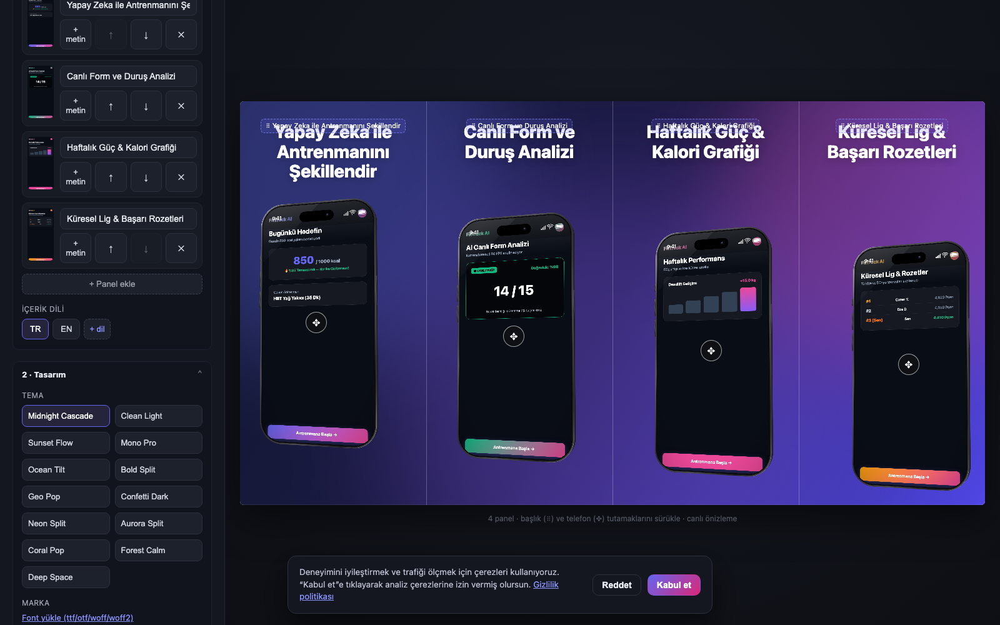

<div align="center">

# 📱 Store Assets Studio (Vitrinshot)

**The open-source, continuous panorama screenshot studio & export engine for App Store and Google Play.**

[](LICENSE)
[](https://www.typescriptlang.org/)
[](https://playwright.dev/)
[](docker-compose.yml)
[](#-privacy--security)
[](#-fastlane--cicd-automation)
[](https://github.com)

<br />

<p align="center">
  🌐 <b>English</b> • <a href="README.tr.md">Türkçe</a> • <a href="README.de.md">Deutsch</a>
</p>

<br />

<p align="center">
  
</p>

<p align="center">
  <b>Design pixel-perfect, multi-language screenshot sequences with 3D device frames, vector status bars, and flowing panoramas — directly in your browser or headlessly in CI/CD.</b>
</p>

<p align="center">
  <a href="#-quick-start">Quick Start</a> •
  <a href="#-why-store-assets-studio">Why This Studio?</a> •
  <a href="#-core-features">Features</a> •
  <a href="#-store-specifications">Store Specs</a> •
  <a href="#-rest-api--automation">REST API</a> •
  <a href="#-monorepo-architecture">Architecture</a> •
  <a href="#-deployment">Deployment</a>
</p>

</div>

---

## 💡 Why Store Assets Studio?

Creating production-grade app store screenshots is painful:
- **Commercial SaaS tools** charge \$20–\$50/month, lock your exports behind paywalls, limit resolutions, or watermark your images.
- **Figma templates** require manual slice maintenance, lack responsive layouts, and frequently produce **RGBA 32-bit PNGs** that trigger Apple App Store upload rejections.
- **Messy real screenshots** captured on physical devices show low battery icons (14%), cellular carrier names, and cluttered notification badges.

**Store Assets Studio** solves this as a **100% free, MIT-licensed, self-hostable suite**:

| Feature | Commercial SaaS (AppLaunchpad, etc.) | Figma Templates | Store Assets Studio |
|---|:---:|:---:|:---:|
| **Cost** | \$19–\$49 / month | One-time or DIY | **100% Free & Open Source** |
| **Store Rejection Protection** | ⚠️ Varies | ❌ Requires manual tooling | **✅ Automatic 24-bit RGB Flattening** |
| **Continuous Panorama** | ⚠️ Complex | ⚠️ Manual alignment | **✅ Native $N \times W$ unified canvas** |
| **Clean Status Bar** | ⚠️ Generic / None | ⚠️ Static masks | **✅ Native iOS (9:41) & Android SVG** |
| **Headless CI/CD / API** | ❌ None | ❌ Manual export | **✅ Node.js + Playwright REST API** |
| **Fastlane Metadata Output** | ❌ Paid / Zip only | ❌ Manual renaming | **✅ Native directory structure** |
| **Privacy & Self-Hosting** | ❌ Closed cloud | Local only | **✅ 100% In-Memory / Zero Tracking** |

---

## ✨ Core Features

### 🎨 1. Continuous Panorama Engine
Panels are not treated as isolated cards. A set of $N$ panels is treated as a **single wide canvas** ($N \times W$).
- Gradients, ambient lighting blobs, stripes, and angled device mockups can span across panel seams.
- When exported, the engine automatically clips the canvas into exact individual store panels. Devices placed on borders appear split across adjacent slides in the App Store gallery for a high-converting **"flowing gallery"** aesthetic.

### 📱 2. 3D Extruded Vector Device Mockups
- Scalable vector frames for iPhone (Titanium, Silver, Black) and iPad.
- Real-time 3D control: adjust **Tilt (Y-axis)**, **Lean (Z-axis)**, **Pitch (X-axis)**, and **Body Depth/Thickness**.
- Extruded chassis with multi-layer metallic shading and floor contact shadows.
- **Frameless (Full-Bleed) Mode**: Screen captures scale to 100% panel width for clean, minimalist modern designs without downsampling.

### ⚡ 3. Store-Standard Vector Status Bar Overlay
Screenshots taken from test devices often have 8% battery, "No Service", or messy notifications. 
- Enable the **Status Bar Cleaner** dropdown in one click.
- Renders crisp SVG status bars:
  - **iOS (Light & Dark):** Standard Apple time `9:41`, full 4-bar cellular reception, full 3-bar Wi-Fi, and 100% filled battery icon.
  - **Android (Light & Dark):** Android standard status layout with material battery and Wi-Fi.
- Includes an optional subtle contrast scrim for readability on light app backgrounds.

### 🛡️ 4. Zero Store Rejections (24-bit RGB Flattening)
- Apple App Store (Guideline 2.3.3) and Google Play Console **strictly reject** screenshots containing an alpha channel (32-bit RGBA).
- Headless browsers natively produce RGBA PNGs.
- Store Assets Studio includes a **pure TypeScript, zero-dependency PNG encoder/decoder** (`png.ts`) that strips the alpha channel and flattens transparency against background colors into pure **24-bit RGB (3 channels)**.

### 🌍 5. Multi-Language (i18n) Batch Localization
- Define your store copy in multiple locales (e.g. `en`, `tr`, `de`, `es`, `ja`).
- Live preview switches instant language contexts on the canvas without page reloads.
- Export all languages simultaneously into localized Fastlane directory structures.

### 📦 6. Fastlane & CI/CD Native
- Download exports formatted directly for Fastlane:
  - `fastlane/metadata/android/[locale]/images/phoneScreenshots/`
  - `fastlane/metadata/ios/[locale]/`
- Eliminates manual drag-and-drop and renaming in App Store Connect / Play Console.

---

## 📐 Store Specifications

Store Assets Studio guarantees exact pixel dimensions matching official store submission requirements:

| Platform | Target ID | Pixel Resolution | Aspect Ratio | Store Category |
|---|---|:---:|:---:|---|
| **Apple App Store** | `ios-6.9` | **1290 × 2796** | 19.5:9 | iPhone 16 Pro Max, 15 Pro Max |
| **Apple App Store** | `ios-6.5` | **1242 × 2688** | 19.5:9 | iPhone 14 Plus, 13 Pro Max, 11 Pro Max |
| **Apple App Store** | `ios-ipad-13` | **2064 × 2752** | 4:3 | iPad Pro 13-inch (M4 / Gen 6) |
| **Google Play** | `android-phone` | **1080 × 2400** | 20:9 | Modern Android Flagships & Pixel |
| **Google Play** | `android-feature-graphic` | **1024 × 500** | ~2:1 | Google Play Store Banner Header |
| **Google Play** | `android-app-icon` | **512 × 512** | 1:1 | High-Res Store Launcher Icon |

---

## 🚀 Quick Start

### Method 1: Docker (Fastest & Self-Contained)

Run the entire suite (Web Editor + Playwright Render Service) with a single command:

```bash
git clone https://github.com/your-username/store-assets-studio.git
cd store-assets-studio

# Build and start on port 8080
docker compose up --build
```

Open your browser at **[http://localhost:8080](http://localhost:8080)**.

---

### Method 2: Local Development (pnpm & Node.js)

**Prerequisites:**
- Node.js 20+
- pnpm 9+ (`corepack enable pnpm` or `npm i -g pnpm`)

```bash
# 1. Clone repository
git clone https://github.com/your-username/store-assets-studio.git
cd store-assets-studio

# 2. Install workspace dependencies
pnpm install

# 3. Install Playwright browser engine (one-time)
pnpm --filter @sas/render-service exec playwright install chromium

# 4. Start local development (Editor on :5173, Render Service on :8787)
pnpm dev
```

Visit the editor at **[http://localhost:5173](http://localhost:5173)**.

---

## 📋 Available Workspace Scripts

Run from the repository root:

| Command | Action |
|---|---|
| `pnpm dev` | Starts both Render Service (`:8787`) and Editor (`:5173`) in parallel |
| `pnpm editor` | Starts only the Vite React Editor dev server |
| `pnpm export:serve` | Starts only the Node.js / Playwright render HTTP daemon |
| `pnpm test` | Runs unit tests (store specs, pure-TS PNG 24-bit encoder) |
| `pnpm test:specs` | Validates store dimension divisibility and target matrices |
| `pnpm test:png` | Runs PNG chunk parser and RGB flattening verification tests |
| `pnpm typecheck` | Runs TypeScript type checking across all monorepo workspaces |
| `pnpm build:web` | Compiles production editor bundle + static site generator (SSG) |

---

## 🤖 REST API & Headless Automation

The render service exposes a clean HTTP endpoint (`POST /export`) allowing you to generate store screenshots programmatically in GitHub Actions, GitLab CI, or terminal scripts.

### Request

```bash
curl -X POST http://localhost:8787/export \
  -H "Content-Type: application/json" \
  -d '{
    "themeId": "midnight-cascade",
    "targetId": "ios-6.9",
    "overrides": {
      "device": {
        "finish": "titanium",
        "statusBar": "ios-light"
      }
    },
    "panels": [
      {
        "screenshotSrc": "data:image/png;base64,...",
        "caption": "Track Your Workouts with AI",
        "texts": [
          { "text": "★ 4.9 Rating", "xFrac": 0.5, "yFrac": 0.12, "color": "#facc15" }
        ]
      },
      {
        "screenshotSrc": "data:image/png;base64,...",
        "caption": "Real-Time 60 FPS Pose Tracking"
      }
    ]
  }'
```

### Response

```json
{
  "results": [
    {
      "target": {
        "id": "ios-6.9",
        "store": "apple",
        "width": 1290,
        "height": 2796
      },
      "panels": [
        { "index": 0, "base64": "iVBORw0KGgo...", "ok": true },
        { "index": 1, "base64": "iVBORw0KGgo...", "ok": true }
      ],
      "allOk": true
    }
  ]
}
```

---

## 🏗️ Monorepo Architecture

The project is structured as an optimized pnpm monorepo with clean layer separation:

```
store-assets-studio/
├── packages/
│   ├── store-specs/        # Canonical registry of store resolutions, aspect ratios & crop helpers
│   ├── device-frames/      # 3D extruded vector phone/tablet frames & SVG status bar generator
│   ├── core-renderer/      # Isomorphic HTML/CSS template engine (WYSIWYG shared by Editor & Node)
│   └── themes/             # Preset themes (gradients, typography, lighting decor, ambient blobs)
│
├── apps/
│   ├── editor/             # React + Vite web application
│   │   ├── src/i18n/       # UI localizations (English, Turkish)
│   │   ├── src/components/ # Studio controls, drag-drop dropzone, canvas zoom & pan
│   │   └── src/routes/     # Editor, landing showcase, docs & legal routes
│   │
│   └── render-service/     # Headless rendering & export service
│       ├── src/server.ts   # Node.js HTTP server (:8787) with concurrency limiter
│       ├── src/render.ts   # Playwright Chromium screenshot capture pipeline
│       ├── src/png.ts      # Pure TypeScript 24-bit RGB encoder & chunk flattener
│       └── src/prerender.ts# SSG prerender script for landing & blog routes
│
├── assets/                 # Readme screenshots and studio branding
├── docker-compose.yml      # Multi-stage production container setup
└── Dockerfile              # Chromium + Node.js Alpine base image
```

---

## ⚙️ Configuration & Environment Variables

Copy `.env.example` to `.env` to configure your instance:

| Variable | Default | Description |
|---|:---:|---|
| `PORT` | `8787` (Docker: `8080`) | HTTP port for the export server |
| `RATE_LIMIT_PER_DAY` | `0` | Daily export limit per IP (`0` = unlimited for self-hosters) |
| `MAX_CONCURRENT_RENDERS` | `4` | Maximum parallel Chromium browser render contexts |
| `ALLOWED_ORIGINS` | `*` | CORS origin allowlist (comma-separated or `*`) |
| `VITE_GA_ID` | *(empty)* | Optional Google Analytics 4 ID (disabled by default) |

---

## 🔒 Privacy & Security

- **Zero Telemetry by Default:** No analytics or third-party tracking scripts load unless you explicitly provide a `VITE_GA_ID`.
- **Client-Side Project Persistence:** Projects are saved directly inside your browser's IndexedDB. Your designs and credentials never touch a remote database.
- **Transient In-Memory Processing:** Images uploaded for export are held strictly in server RAM during rendering and immediately freed after response completion. Nothing is stored to disk.

---

## 🤝 Contributing

Contributions make the open-source community thrive! We welcome bug fixes, new features, and translations:

1. **Fork the Project**
2. **Create your Feature Branch** (`git checkout -b feat/apple-watch-frames`)
3. **Commit your Changes** (`git commit -m 'feat: add apple watch series 10 frames'`)
4. **Push to the Branch** (`git push origin feat/apple-watch-frames`)
5. **Open a Pull Request**

Please make sure all tests and type checks pass prior to opening a PR:
```bash
pnpm test
pnpm typecheck
```

---

## 🌐 Translations

This documentation is available in multiple languages:
- 🇬🇧 [English](README.md) (Default)
- 🇹🇷 [Türkçe](README.tr.md)
- 🇩🇪 [Deutsch](README.de.md)

> **Help us translate:** If you would like to translate this documentation into Spanish, French, Japanese, or Chinese, pull requests with new `README.<locale>.md` files are warmly welcome!

---

## 📄 License

Distributed under the **MIT License**. Free for personal, commercial, and enterprise use. See [`LICENSE`](LICENSE) for details.

<div align="center">
  <sub>Built with ❤️ by Store Assets Studio Contributors for mobile developers worldwide.</sub>
</div>
